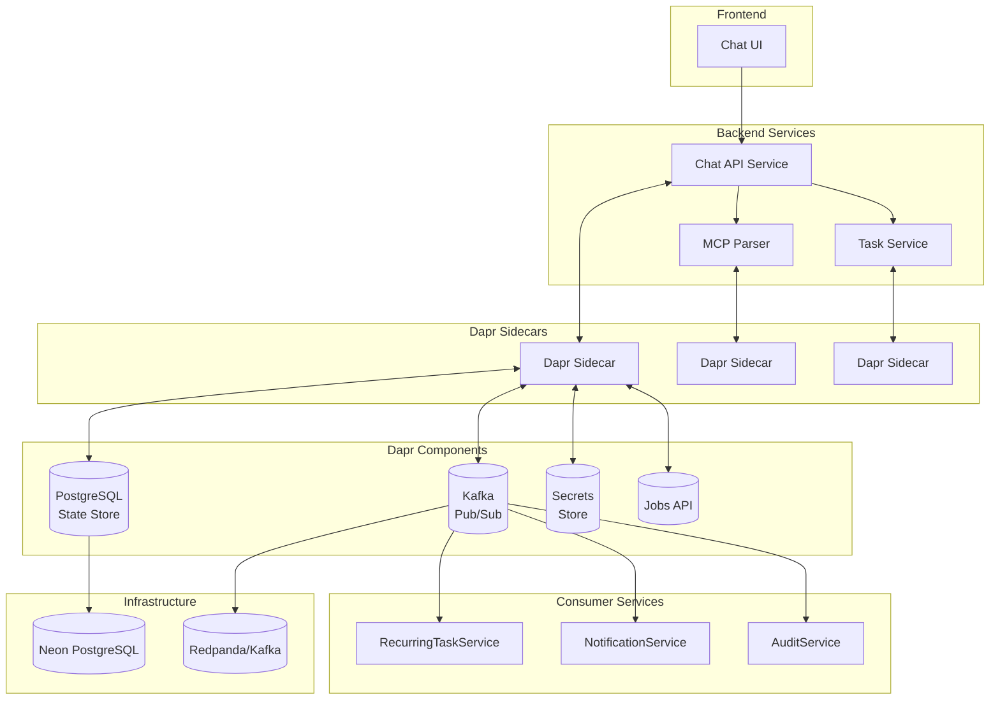

# Todo Chatbot - Phase V Part A: Advanced Features Implementation

This project implements advanced todo features with event-driven architecture using Dapr for the Todo Chatbot. This includes recurring tasks, due dates & reminders, priority levels, tagging system, search/filtering capabilities, and event-driven processing using Kafka/Redpanda with Dapr abstractions.

## Features

- **Recurring Tasks**: Support daily/weekly/monthly recurrence with automatic generation of next instances
- **Due Dates & Reminders**: Set due dates and receive reminders at specified times
- **Priorities**: Low/Medium/High priority levels with filtering capabilities
- **Tags**: Multi-tag support for tasks with search and filtering
- **Search & Filter**: Full-text search and advanced filtering/sorting capabilities
- **Event-Driven Architecture**: Asynchronous processing using Kafka/Redpanda and Dapr pub/sub
- **Dapr Integration**: Distributed runtime with pub/sub, state management, jobs API, and secrets

## Tech Stack

- **Backend**: FastAPI + SQLModel + Neon PostgreSQL
- **Frontend**: Next.js 14 with React
- **Event Bus**: Apache Kafka via Redpanda (local dev)
- **Distributed Runtime**: Dapr (Distributed Application Runtime)
- **Job Scheduler**: Dapr Jobs API
- **Service Discovery**: Dapr service invocation
- **Secrets Management**: Dapr secrets API
- **State Management**: Dapr state store API

## Prerequisites

- Docker and Docker Compose
- Dapr CLI installed and initialized
- Python 3.11+
- Node.js 18+ (for frontend)

## Setup Instructions

### 1. Initialize Dapr

```bash
dapr init
```

### 2. Clone and Navigate to Project

```bash
git clone <repository-url>
cd Todo-Full-stack
```

### 3. Start Infrastructure Services

```bash
# Start Kafka (via Redpanda), PostgreSQL, and other services
docker-compose up -d

# Wait for services to be ready
sleep 30
```

### 4. Backend Setup

```bash
cd backend

# Install Python dependencies
pip install -r requirements.txt

# Set up environment variables
cp .env.example .env
# Edit .env with your configuration

# Run database migrations
# (Assuming you have alembic set up)
alembic upgrade head
```

### 5. Frontend Setup

```bash
cd frontend

# Install dependencies
npm install

# Set up environment variables
cp .env.local.example .env.local
# Edit .env.local with your configuration
```

### 6. Run the Application with Dapr

#### Backend (from project root):
```bash
# Run the main API service with Dapr
dapr run \
  --app-id chat-api \
  --app-port 8000 \
  --dapr-http-port 3500 \
  --dapr-grpc-port 50001 \
  --config ./dapr-components/config.yaml \
  --components-path ./dapr-components \
  -- python -m backend.src.main
```

#### Consumer Services (in separate terminals):
```bash
# Notification Service
dapr run \
  --app-id notification-service \
  --app-port 8001 \
  --dapr-http-port 3501 \
  --dapr-grpc-port 50002 \
  --config ./dapr-components/config.yaml \
  --components-path ./dapr-components \
  -- python -m consumers.notification_service.main

# Recurring Task Service
dapr run \
  --app-id recurring-task-service \
  --app-port 8002 \
  --dapr-http-port 3502 \
  --dapr-grpc-port 50003 \
  --config ./dapr-components/config.yaml \
  --components-path ./dapr-components \
  -- python -m consumers.recurring_task_service.main

# Audit Service
dapr run \
  --app-id audit-service \
  --app-port 8003 \
  --dapr-http-port 3503 \
  --dapr-grpc-port 50004 \
  --config ./dapr-components/config.yaml \
  --components-path ./dapr-components \
  -- python -m consumers.audit_service.main
```

#### Frontend:
```bash
cd frontend
npm run dev
```

## Architecture Overview



## Event-Driven Design

### Topics & Schemas

#### Topic: task-events
```json
{
  "event_type": "created|updated|completed|deleted",
  "task_id": 123,
  "task_data": {
    "title": "Sample task",
    "description": "Task description",
    "priority": "high",
    "tags": ["work", "important"],
    "due_date": "2026-02-10T10:00:00Z",
    "remind_at": "2026-02-10T09:00:00Z",
    "recurrence_type": "daily",
    "recurrence_interval": 1
  },
  "user_id": "user123",
  "timestamp": "2026-02-08T18:43:00Z"
}
```

#### Topic: reminders
```json
{
  "event_type": "reminder_triggered",
  "task_id": 123,
  "user_id": "user123",
  "task_title": "Sample task",
  "reminder_time": "2026-02-10T09:00:00Z",
  "timestamp": "2026-02-10T09:00:00Z"
}
```

### Producers & Consumers
- **Chat API Service**: Publishes to `task-events` on task CRUD operations
- **Chat API Service**: Publishes to `reminders` when reminder time arrives
- **RecurringTaskService**: Publishes to `task-events` when creating next recurring instance
- **NotificationService**: Consumes from `reminders` to send notifications
- **AuditService**: Consumes from `task-events` and `reminders` for audit logging

## Development

### Running Tests

```bash
# Backend tests
cd backend
pytest

# Run specific test suites
pytest tests/unit/
pytest tests/integration/
pytest tests/contract/
```

### Local Development with Hot Reload

For backend development with hot reload:
```bash
dapr run --app-id chat-api -- python -m uvicorn backend.src.main:app --reload
```

## Troubleshooting

### Common Issues

1. **Dapr Sidecar Not Starting**
   - Ensure Dapr is properly initialized: `dapr uninstall && dapr init`
   - Check if ports are available: `lsof -i :3500` (or relevant port)

2. **Kafka Connection Issues**
   - Verify Redpanda is running: `docker ps | grep redpanda`
   - Check connectivity: `telnet localhost 9092`

3. **Database Connection Issues**
   - Verify PostgreSQL is running: `docker ps | grep postgres`
   - Check connection string in environment variables

### Useful Commands

- Check Dapr sidecar logs: `dapr logs <app-id>`
- List running Dapr apps: `dapr list`
- Check component health: `dapr components`
- View sent events: Check the `task_events` table in PostgreSQL

## Contributing

1. Fork the repository
2. Create a feature branch (`git checkout -b feature/amazing-feature`)
3. Make your changes
4. Add tests for new functionality
5. Ensure all tests pass (`pytest`)
6. Commit your changes (`git commit -m 'Add amazing feature'`)
7. Push to the branch (`git push origin feature/amazing-feature`)
8. Open a Pull Request

## License

This project is licensed under the MIT License - see the LICENSE file for details.