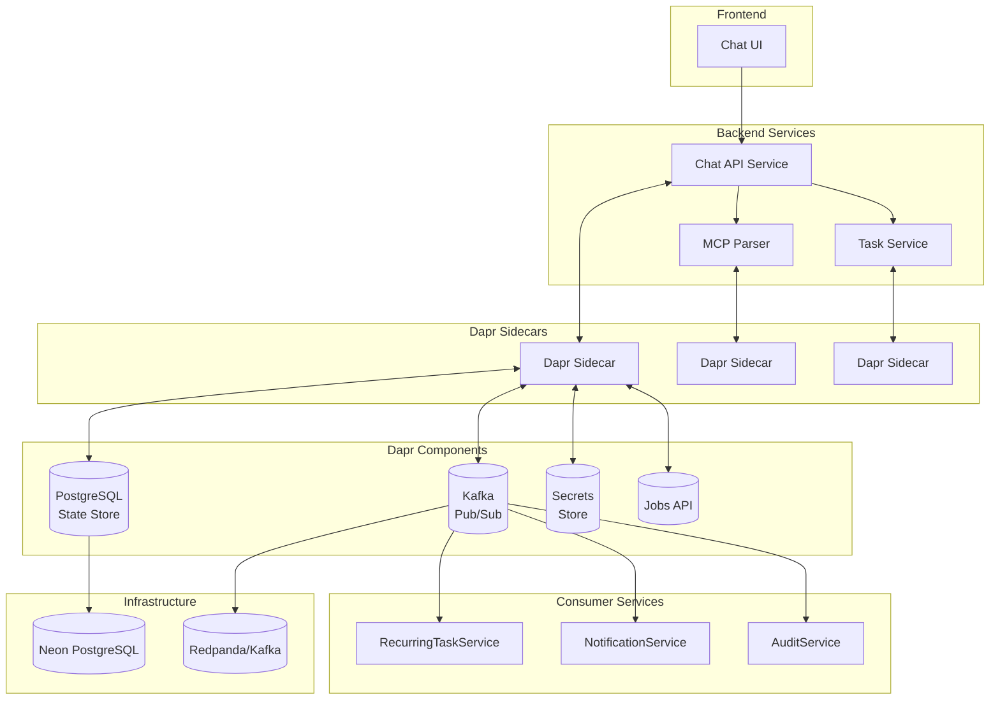

# Phase V Part A - Technical Implementation Plan

**Branch**: `001-advanced-todo-features` | **Date**: 2026-02-08 | **Spec**: [link](spec.md)
**Input**: Feature specification from `/specs/001-advanced-todo-features/spec.md`

**Note**: This template is filled in by the `/sp.plan` command. See `.specify/templates/commands/plan.md` for the execution workflow.

## Summary

Implementation of advanced todo features with event-driven architecture using Dapr for the Todo Chatbot. This includes recurring tasks, due dates & reminders, priority levels, tagging system, search/filtering capabilities, and event-driven processing using Kafka/Redpanda with Dapr abstractions. The solution maintains backward compatibility with existing Phase IV functionality while introducing scalable, loosely-coupled architecture.

## Technical Context

**Language/Version**: Python 3.11
**Primary Dependencies**: FastAPI, SQLModel, Dapr SDK, kafka-python, Neon PostgreSQL
**Storage**: PostgreSQL (Neon), with Dapr state management abstraction
**Testing**: pytest for unit/integration tests, with Dapr component mocks
**Target Platform**: Containerized microservices on Kubernetes (Minikube for local dev)
**Project Type**: Web application (backend API + frontend UI)
**Performance Goals**: <2s response time for search operations, <500ms for CRUD operations, support 1000 concurrent users
**Constraints**: Must maintain backward compatibility with Phase IV, use Dapr for all distributed concerns, no direct Kafka/DB calls in app code
**Scale/Scope**: Support 10k users, 1M tasks, with horizontal scaling via event-driven architecture

## Constitution Check

*GATE: Must pass before Phase 0 research. Re-check after Phase 1 design.*

- [x] All new features have test-first approach planned
- [x] Integration testing strategy defined for Dapr components
- [x] Observability considerations included (structured logging, tracing)
- [x] Versioning strategy maintained (backward compatibility with Phase IV)
- [x] Simplicity principle followed (using established patterns)

## Project Structure

### Documentation (this feature)

```text
specs/001-advanced-todo-features/
├── plan.md              # This file (/sp.plan command output)
├── research.md          # Phase 0 output (/sp.plan command)
├── data-model.md        # Phase 1 output (/sp.plan command)
├── quickstart.md        # Phase 1 output (/sp.plan command)
├── contracts/           # Phase 1 output (/sp.plan command)
└── tasks.md             # Phase 2 output (/sp.tasks command - NOT created by /sp.plan)
```

### Source Code (repository root)

```text
backend/
├── src/
│   ├── models/              # SQLModel definitions with new fields
│   ├── services/            # Business logic for advanced features
│   ├── api/                 # Updated endpoints with new functionality
│   ├── dapr/                # Dapr integration helpers and configs
│   ├── events/              # Event schemas and publishing logic
│   └── utils/               # Utility functions for MCP parsing
├── consumers/               # Separate apps for event consumers
│   ├── recurring_task_service/
│   ├── notification_service/
│   └── audit_service/
├── dapr-components/         # Dapr component configurations
│   ├── pubsub.yaml          # Kafka pubsub configuration
│   ├── statestore.yaml      # PostgreSQL state store
│   ├── secrets.yaml         # Kubernetes secrets configuration
│   └── bindings-jobs.yaml   # Job scheduling configuration
└── tests/
    ├── unit/
    ├── integration/
    └── contract/

frontend/
├── src/
│   ├── components/
│   │   ├── TaskForm.jsx     # Updated form with new fields
│   │   ├── TaskList.jsx     # Filtering/sorting capabilities
│   │   └── TaskCard.jsx     # Display priority/tags/due dates
│   └── services/
│       └── api.js           # Updated API calls
└── tests/

docker-compose.yml          # Includes Redpanda for local Kafka
k8s-deployment.md           # Updated manifests for new services
```

**Structure Decision**: Web application with backend API and frontend UI, with separate consumer services for event processing. This maintains separation of concerns while enabling scalable event-driven processing.

## Complexity Tracking

> **Fill ONLY if Constitution Check has violations that must be justified**

| Violation | Why Needed | Simpler Alternative Rejected Because |
|-----------|------------|-------------------------------------|
| Multiple services | Event-driven architecture requires separation | Single service would block on event processing |
| Dapr abstraction layer | Distributed concerns need proper abstraction | Direct Kafka/DB calls would create tight coupling |

## 1. Architecture Overview



## 2. Technology & Component Decisions

- **Backend Framework**: FastAPI for async support and excellent OpenAPI integration
- **ORM**: SQLModel (by the creator of FastAPI) for type-safe database operations
- **Database**: Neon PostgreSQL (PostgreSQL-compatible with serverless features)
- **Event Bus**: Apache Kafka via Redpanda (local dev) - high-performance, durable messaging
- **Distributed Runtime**: Dapr (Distributed Application Runtime) for portable microservices
- **Message Queue**: Kafka topics for decoupled event processing
- **Job Scheduler**: Dapr Jobs API for precise timing of reminders and recurring tasks
- **Service Discovery**: Dapr service invocation for inter-service communication
- **Secrets Management**: Dapr secrets API with Kubernetes secrets store
- **State Management**: Dapr state store API with PostgreSQL backend

## 3. Database Schema Changes & Migrations

### Updated Task Model
```sql
-- Existing columns preserved for backward compatibility
ALTER TABLE tasks ADD COLUMN priority VARCHAR(10) DEFAULT 'medium' CHECK (priority IN ('low', 'medium', 'high'));
ALTER TABLE tasks ADD COLUMN tags TEXT[] DEFAULT '{}';
ALTER TABLE tasks ADD COLUMN due_date TIMESTAMP WITH TIME ZONE;
ALTER TABLE tasks ADD COLUMN remind_at TIMESTAMP WITH TIME ZONE;
ALTER TABLE tasks ADD COLUMN recurrence_type VARCHAR(20) DEFAULT 'none' CHECK (recurrence_type IN ('none', 'daily', 'weekly', 'monthly'));
ALTER TABLE tasks ADD COLUMN recurrence_interval INTEGER DEFAULT 1;
```

### New Tables for Event Tracking
```sql
CREATE TABLE task_events (
    id SERIAL PRIMARY KEY,
    event_type VARCHAR(50) NOT NULL,
    task_id INTEGER REFERENCES tasks(id),
    user_id VARCHAR(100) NOT NULL,
    payload JSONB NOT NULL,
    created_at TIMESTAMP WITH TIME ZONE DEFAULT NOW()
);

CREATE TABLE scheduled_jobs (
    id VARCHAR(100) PRIMARY KEY,  -- Dapr job ID
    job_type VARCHAR(50) NOT NULL,  -- 'reminder', 'recurring_next'
    task_id INTEGER REFERENCES tasks(id),
    user_id VARCHAR(100) NOT NULL,
    scheduled_time TIMESTAMP WITH TIME ZONE NOT NULL,
    created_at TIMESTAMP WITH TIME ZONE DEFAULT NOW(),
    executed BOOLEAN DEFAULT FALSE
);
```

### Migration Script
```python
# backend/src/db/migrations/001_advanced_features.py
from sqlmodel import Session, select
from backend.src.models.task import Task
from alembic import op
import sqlalchemy as sa

def upgrade():
    # Add new columns to tasks table
    op.add_column('tasks', sa.Column('priority', sa.String(10), server_default='medium'))
    op.execute("ALTER TABLE tasks ADD CONSTRAINT chk_priority CHECK (priority IN ('low', 'medium', 'high'))")
    
    op.add_column('tasks', sa.Column('tags', sa.ARRAY(sa.String)))
    op.execute("ALTER TABLE tasks ALTER COLUMN tags SET DEFAULT '{}'")
    
    op.add_column('tasks', sa.Column('due_date', sa.DateTime(timezone=True)))
    op.add_column('tasks', sa.Column('remind_at', sa.DateTime(timezone=True)))
    op.add_column('tasks', sa.Column('recurrence_type', sa.String(20), server_default='none'))
    op.execute("ALTER TABLE tasks ADD CONSTRAINT chk_recurrence CHECK (recurrence_type IN ('none', 'daily', 'weekly', 'monthly'))")
    
    op.add_column('tasks', sa.Column('recurrence_interval', sa.Integer, server_default='1'))

    # Create new tables
    op.create_table('task_events',
        sa.Column('id', sa.Integer(), nullable=False),
        sa.Column('event_type', sa.String(50), nullable=False),
        sa.Column('task_id', sa.Integer(), nullable=True),
        sa.Column('user_id', sa.String(100), nullable=False),
        sa.Column('payload', sa.JSON(), nullable=False),
        sa.Column('created_at', sa.DateTime(timezone=True), server_default=sa.text('now()')),
        sa.ForeignKeyConstraint(['task_id'], ['tasks.id'], ),
        sa.PrimaryKeyConstraint('id')
    )
    
    op.create_table('scheduled_jobs',
        sa.Column('id', sa.String(100), nullable=False),
        sa.Column('job_type', sa.String(50), nullable=False),
        sa.Column('task_id', sa.Integer(), nullable=True),
        sa.Column('user_id', sa.String(100), nullable=False),
        sa.Column('scheduled_time', sa.DateTime(timezone=True), nullable=False),
        sa.Column('created_at', sa.DateTime(timezone=True), server_default=sa.text('now()')),
        sa.Column('executed', sa.Boolean(), server_default='false'),
        sa.ForeignKeyConstraint(['task_id'], ['tasks.id'], ),
        sa.PrimaryKeyConstraint('id')
    )

def downgrade():
    op.drop_table('scheduled_jobs')
    op.drop_table('task_events')
    
    op.drop_constraint('chk_recurrence', 'tasks', type_='check')
    op.drop_constraint('chk_priority', 'tasks', type_='check')
    
    op.drop_column('tasks', 'recurrence_interval')
    op.drop_column('tasks', 'recurrence_type')
    op.drop_column('tasks', 'remind_at')
    op.drop_column('tasks', 'due_date')
    op.drop_column('tasks', 'tags')
    op.drop_column('tasks', 'priority')
```

## 4. Dapr Components (YAML snippets for each: pubsub, state, secrets, jobs config)

### Kafka Pub/Sub Configuration
```yaml
# dapr-components/pubsub.yaml
apiVersion: dapr.io/v1alpha1
kind: Component
metadata:
  name: kafka-pubsub
spec:
  type: pubsub.kafka
  version: v1
  metadata:
  - name: brokers
    value: "kafka:9092"  # For local dev with docker-compose
  - name: consumerGroup
    value: "todo-service"
  - name: clientID
    value: "todo-chatbot"
  - name: authType
    value: "none"
  - name: maxMessageBytes
    value: 1000000
  - name: consumeRetryInterval
    value: "100ms"
```

### PostgreSQL State Store
```yaml
# dapr-components/statestore.yaml
apiVersion: dapr.io/v1alpha1
kind: Component
metadata:
  name: statestore
spec:
  type: state.postgresql
  version: v1
  metadata:
  - name: connectionString
    secretKeyRef:
      name: postgresql-connection-string
      key: connection-string
  - name: actorStateStore
    value: "true"
  - name: concurrency
    value: "first-write"
  - name: keyPrefix
    value: "none"
```

### Secrets Configuration
```yaml
# dapr-components/secrets.yaml
apiVersion: dapr.io/v1alpha1
kind: Component
metadata:
  name: kubernetes-secrets
spec:
  type: secretstores.kubernetes
  version: v1
  metadata: []
```

### Jobs Configuration (Conceptual - Dapr Jobs API)
```yaml
# dapr-components/bindings-jobs.yaml
apiVersion: dapr.io/v1alpha1
kind: Component
metadata:
  name: job-scheduler
spec:
  type: bindings.cron
  version: v1
  metadata:
  - name: schedule
    value: "*/1 * * * *"  # Check for scheduled jobs every minute
```

## 5. Event-Driven Design

### Topics & Schemas
```json
// Topic: task-events
{
  "event_type": "created|updated|completed|deleted",
  "task_id": 123,
  "task_data": {
    "title": "Sample task",
    "description": "Task description",
    "priority": "high",
    "tags": ["work", "important"],
    "due_date": "2026-02-10T10:00:00Z",
    "remind_at": "2026-02-10T09:00:00Z",
    "recurrence_type": "daily",
    "recurrence_interval": 1
  },
  "user_id": "user123",
  "timestamp": "2026-02-08T18:43:00Z"
}

// Topic: reminders
{
  "event_type": "reminder_triggered",
  "task_id": 123,
  "user_id": "user123",
  "task_title": "Sample task",
  "reminder_time": "2026-02-10T09:00:00Z",
  "timestamp": "2026-02-10T09:00:00Z"
}

// Topic: task-updates
{
  "event_type": "sync_request|sync_response",
  "operation": "create|update|delete",
  "task_id": 123,
  "user_id": "user123",
  "timestamp": "2026-02-08T18:43:00Z"
}
```

### Producers (which services, when)
- **Chat API Service**: Publishes to `task-events` on task CRUD operations
- **Chat API Service**: Publishes to `reminders` when reminder time arrives
- **RecurringTaskService**: Publishes to `task-events` when creating next recurring instance

### Consumers (stub logic)
```python
# consumers/notification_service/main.py
from dapr.ext.grpc import App
from dapr.clients import DaprClient
import json

app = App()

@app.subscribe(pubsub_name='kafka-pubsub', topic='reminders')
def reminder_handler(event_data):
    with DaprClient() as client:
        reminder_event = json.loads(event_data.data)
        
        # Send notification to user (email, push, etc.)
        user_id = reminder_event['user_id']
        task_title = reminder_event['task_title']
        
        # Implementation would send actual notification
        print(f"Sending reminder to user {user_id}: {task_title}")
        
        # Log the notification
        client.publish_event(
            pubsub_name='kafka-pubsub',
            topic='task-updates',
            data=json.dumps({
                'event_type': 'notification_sent',
                'user_id': user_id,
                'task_id': reminder_event['task_id'],
                'timestamp': reminder_event['timestamp']
            })
        )

# consumers/recurring_task_service/main.py
@app.subscribe(pubsub_name='kafka-pubsub', topic='task-events')
def task_event_handler(event_data):
    with DaprClient() as client:
        task_event = json.loads(event_data.data)
        
        if task_event['event_type'] == 'completed' and task_event['task_data']['recurrence_type'] != 'none':
            # Create next recurring instance
            next_task = create_next_recurring_instance(task_event['task_data'])
            
            # Publish event for new task creation
            client.publish_event(
                pubsub_name='kafka-pubsub',
                topic='task-events',
                data=json.dumps({
                    'event_type': 'created',
                    'task_id': next_task['id'],
                    'task_data': next_task,
                    'user_id': task_event['user_id'],
                    'timestamp': next_task['created_at']
                })
            )

def create_next_recurring_instance(task_data):
    # Logic to calculate next occurrence based on recurrence_type
    # Daily: add 1 day
    # Weekly: add 7 days
    # Monthly: add 1 month (with proper day handling)
    pass
```

## 6. Feature Implementation Breakdown

### Recurring Tasks
- **Database**: Add `recurrence_type` (enum) and `recurrence_interval` (int) fields to Task model
- **API**: Extend `/tasks` endpoints to accept recurrence parameters
- **Logic**: When a recurring task is completed, automatically create the next instance
- **Scheduling**: Use Dapr Jobs API to schedule creation of next instance
- **Events**: Publish task-event when next instance is created

### Due Dates & Reminders
- **Database**: Add `due_date` (timestamp) and `remind_at` (timestamp) fields to Task model
- **API**: Extend `/tasks` endpoints to accept due date and reminder time
- **Scheduling**: Use Dapr Jobs API to schedule reminder at `remind_at` time
- **Notifications**: When reminder job executes, publish to `reminders` topic
- **Events**: Publish reminder event when time arrives

### Priorities
- **Database**: Add `priority` (enum: low/medium/high) field to Task model
- **API**: Extend `/tasks` endpoints to accept priority
- **UI**: Update task form to include priority selection
- **Filtering**: Add query parameters to filter by priority

### Tags
- **Database**: Add `tags` (text array) field to Task model
- **API**: Extend `/tasks` endpoints to accept tags array
- **UI**: Update task form to include tag input
- **Filtering**: Add query parameters to filter by tags
- **Search**: Include tags in full-text search

### Search / Filter / Sort
- **API**: Add `/tasks/search` endpoint with full-text search capability
- **Database**: Use PostgreSQL full-text search or LIKE queries
- **Query Parameters**: Support filtering by due date range, priority, tags, completion status
- **Sorting**: Support sorting by due date, priority, creation date, title

## 7. Code Structure & Key File Changes

### Updated Models (SQLModel)
```python
# backend/src/models/task.py
from sqlmodel import SQLModel, Field, ARRAY, String
from datetime import datetime
from typing import List, Optional

class TaskBase(SQLModel):
    title: str
    description: Optional[str] = None
    completed: bool = False
    user_id: str

class Task(TaskBase, table=True):
    id: Optional[int] = Field(default=None, primary_key=True)
    priority: str = Field(default="medium", max_length=10)  # low, medium, high
    tags: List[str] = Field(default=[], sa_column=Field(ARRAY(String)))  # e.g., ["work", "personal"]
    due_date: Optional[datetime] = None
    remind_at: Optional[datetime] = None
    recurrence_type: str = Field(default="none", max_length=20)  # none, daily, weekly, monthly
    recurrence_interval: int = Field(default=1)
    created_at: datetime = Field(default_factory=datetime.utcnow)
    updated_at: datetime = Field(default_factory=datetime.utcnow)

class TaskCreate(TaskBase):
    priority: Optional[str] = "medium"
    tags: List[str] = []
    due_date: Optional[datetime] = None
    remind_at: Optional[datetime] = None
    recurrence_type: Optional[str] = "none"
    recurrence_interval: Optional[int] = 1

class TaskUpdate(SQLModel):
    title: Optional[str] = None
    description: Optional[str] = None
    completed: Optional[bool] = None
    priority: Optional[str] = None
    tags: Optional[List[str]] = None
    due_date: Optional[datetime] = None
    remind_at: Optional[datetime] = None
    recurrence_type: Optional[str] = None
    recurrence_interval: Optional[int] = None
```

### New/Updated Endpoints in Chat API
```python
# backend/src/api/tasks.py
from fastapi import APIRouter, Depends, Query
from sqlmodel import Session, select
from typing import List, Optional
from backend.src.database import get_session
from backend.src.models.task import Task, TaskCreate, TaskUpdate
from backend.src.services.dapr_client import dapr_publish_event, dapr_schedule_job
from datetime import datetime
import uuid

router = APIRouter(prefix="/tasks", tags=["tasks"])

@router.post("/", response_model=Task)
async def create_task(task: TaskCreate, session: Session = Depends(get_session)):
    db_task = Task.from_orm(task)
    session.add(db_task)
    session.commit()
    session.refresh(db_task)
    
    # Publish task creation event
    await dapr_publish_event(
        pubsub_name="kafka-pubsub",
        topic="task-events",
        data={
            "event_type": "created",
            "task_id": db_task.id,
            "task_data": db_task.dict(),
            "user_id": db_task.user_id,
            "timestamp": datetime.utcnow().isoformat()
        }
    )
    
    # Schedule reminder if specified
    if db_task.remind_at:
        job_id = f"reminder-{db_task.id}-{uuid.uuid4()}"
        await dapr_schedule_job(
            job_id=job_id,
            due_time=db_task.remind_at.isoformat(),
            data={
                "task_id": db_task.id,
                "user_id": db_task.user_id,
                "task_title": db_task.title
            }
        )
    
    # Schedule next recurring task if applicable
    if db_task.recurrence_type != "none":
        job_id = f"recurring-{db_task.id}-{uuid.uuid4()}"
        next_occurrence_time = calculate_next_occurrence(
            db_task.due_date or datetime.utcnow(),
            db_task.recurrence_type,
            db_task.recurrence_interval
        )
        await dapr_schedule_job(
            job_id=job_id,
            due_time=next_occurrence_time.isoformat(),
            data={
                "original_task_id": db_task.id,
                "user_id": db_task.user_id
            }
        )
    
    return db_task

@router.get("/", response_model=List[Task])
async def get_tasks(
    user_id: str = Query(...),
    priority: Optional[str] = Query(None),
    tags: Optional[List[str]] = Query(None),
    due_date_start: Optional[datetime] = Query(None),
    due_date_end: Optional[datetime] = Query(None),
    completed: Optional[bool] = Query(None),
    sort_by: Optional[str] = Query("created_at"),
    sort_order: Optional[str] = Query("desc"),
    session: Session = Depends(get_session)
):
    query = select(Task).where(Task.user_id == user_id)
    
    if priority:
        query = query.where(Task.priority == priority)
    
    if tags:
        for tag in tags:
            query = query.where(Task.tags.contains([tag]))
    
    if due_date_start:
        query = query.where(Task.due_date >= due_date_start)
    
    if due_date_end:
        query = query.where(Task.due_date <= due_date_end)
    
    if completed is not None:
        query = query.where(Task.completed == completed)
    
    # Apply sorting
    if sort_by == "due_date":
        query = query.order_by(Task.due_date.desc() if sort_order == "desc" else Task.due_date.asc())
    elif sort_by == "priority":
        # Map priority to numeric values for proper sorting
        priority_order = {"high": 3, "medium": 2, "low": 1}
        # This would require a custom sort in the query or post-processing
        pass
    else:
        query = query.order_by(Task.created_at.desc() if sort_order == "desc" else Task.created_at.asc())
    
    tasks = session.exec(query).all()
    return tasks

@router.put("/{task_id}", response_model=Task)
async def update_task(task_id: int, task_update: TaskUpdate, session: Session = Depends(get_session)):
    db_task = session.get(Task, task_id)
    if not db_task:
        raise HTTPException(status_code=404, detail="Task not found")
    
    # Store old values for comparison
    old_remind_at = db_task.remind_at
    old_recurrence_type = db_task.recurrence_type
    
    # Update task
    update_data = task_update.dict(exclude_unset=True)
    for field, value in update_data.items():
        setattr(db_task, field, value)
    
    session.add(db_task)
    session.commit()
    session.refresh(db_task)
    
    # Publish task update event
    await dapr_publish_event(
        pubsub_name="kafka-pubsub",
        topic="task-events",
        data={
            "event_type": "updated",
            "task_id": db_task.id,
            "task_data": db_task.dict(),
            "user_id": db_task.user_id,
            "timestamp": datetime.utcnow().isoformat()
        }
    )
    
    # Cancel old reminder if it existed and was changed
    if old_remind_at and (not task_update.remind_at or task_update.remind_at != old_remind_at):
        # Cancel the old reminder job via Dapr
        pass
    
    # Schedule new reminder if added or changed
    if db_task.remind_at and db_task.remind_at != old_remind_at:
        job_id = f"reminder-{db_task.id}-{uuid.uuid4()}"
        await dapr_schedule_job(
            job_id=job_id,
            due_time=db_task.remind_at.isoformat(),
            data={
                "task_id": db_task.id,
                "user_id": db_task.user_id,
                "task_title": db_task.title
            }
        )
    
    # Cancel old recurrence job if it existed and was changed
    if old_recurrence_type != "none" and (not task_update.recurrence_type or task_update.recurrence_type != old_recurrence_type):
        # Cancel the old recurrence job via Dapr
        pass
    
    # Schedule new recurrence job if added or changed
    if db_task.recurrence_type != "none" and db_task.recurrence_type != old_recurrence_type:
        job_id = f"recurring-{db_task.id}-{uuid.uuid4()}"
        next_occurrence_time = calculate_next_occurrence(
            db_task.due_date or datetime.utcnow(),
            db_task.recurrence_type,
            db_task.recurrence_interval
        )
        await dapr_schedule_job(
            job_id=job_id,
            due_time=next_occurrence_time.isoformat(),
            data={
                "original_task_id": db_task.id,
                "user_id": db_task.user_id
            }
        )
    
    return db_task

@router.patch("/{task_id}/complete", response_model=Task)
async def complete_task(task_id: int, session: Session = Depends(get_session)):
    db_task = session.get(Task, task_id)
    if not db_task:
        raise HTTPException(status_code=404, detail="Task not found")
    
    db_task.completed = True
    session.add(db_task)
    session.commit()
    session.refresh(db_task)
    
    # Publish task completion event
    await dapr_publish_event(
        pubsub_name="kafka-pubsub",
        topic="task-events",
        data={
            "event_type": "completed",
            "task_id": db_task.id,
            "task_data": db_task.dict(),
            "user_id": db_task.user_id,
            "timestamp": datetime.utcnow().isoformat()
        }
    )
    
    # If it's a recurring task, create the next instance
    if db_task.recurrence_type != "none":
        next_task_data = create_next_recurring_instance(db_task)
        next_db_task = Task.from_orm(next_task_data)
        session.add(next_db_task)
        session.commit()
        session.refresh(next_db_task)
        
        # Publish event for the new recurring task
        await dapr_publish_event(
            pubsub_name="kafka-pubsub",
            topic="task-events",
            data={
                "event_type": "created",
                "task_id": next_db_task.id,
                "task_data": next_db_task.dict(),
                "user_id": next_db_task.user_id,
                "timestamp": datetime.utcnow().isoformat()
            }
        )
    
    return db_task

def calculate_next_occurrence(current_date, recurrence_type, interval):
    """Calculate the next occurrence based on recurrence type and interval."""
    from datetime import timedelta
    
    if recurrence_type == "daily":
        return current_date + timedelta(days=interval)
    elif recurrence_type == "weekly":
        return current_date + timedelta(weeks=interval)
    elif recurrence_type == "monthly":
        # Simple implementation - adds roughly a month
        # In production, would need to handle month-end dates properly
        import calendar
        current_year = current_date.year
        current_month = current_date.month
        
        # Calculate new month and year
        new_month = current_month + interval
        new_year = current_year + (new_month - 1) // 12
        new_month = ((new_month - 1) % 12) + 1
        
        # Handle day overflow (e.g., Jan 31 + 1 month -> Feb 28/29)
        max_day_in_new_month = calendar.monthrange(new_year, new_month)[1]
        new_day = min(current_date.day, max_day_in_new_month)
        
        return current_date.replace(year=new_year, month=new_month, day=new_day)
    else:
        return current_date  # Default case

def create_next_recurring_instance(task):
    """Create the next instance of a recurring task."""
    from copy import deepcopy
    
    next_task = deepcopy(task)
    next_task.id = None  # Reset ID for new record
    next_task.completed = False
    next_task.created_at = datetime.utcnow()
    next_task.updated_at = datetime.utcnow()
    
    # Update due date to next occurrence
    if task.due_date:
        next_task.due_date = calculate_next_occurrence(
            task.due_date,
            task.recurrence_type,
            task.recurrence_interval
        )
    
    # Update reminder time if applicable
    if task.remind_at and task.due_date:
        # Calculate the time difference between due date and reminder
        time_diff = task.remind_at - task.due_date
        next_task.remind_at = next_task.due_date + time_diff
    
    return next_task
```

### Dapr Integration Helpers
```python
# backend/src/services/dapr_client.py
import aiohttp
import json
from typing import Dict, Any
from backend.src.config import DAPR_HTTP_PORT, DAPR_API_TOKEN

async def dapr_publish_event(pubsub_name: str, topic: str, data: Dict[str, Any]):
    """Publish an event to Dapr pub/sub."""
    url = f"http://localhost:{DAPR_HTTP_PORT}/v1.0/publish/{pubsub_name}/{topic}"
    
    headers = {
        "Content-Type": "application/json"
    }
    
    if DAPR_API_TOKEN:
        headers["dapr-api-token"] = DAPR_API_TOKEN
    
    async with aiohttp.ClientSession() as session:
        async with session.post(url, headers=headers, data=json.dumps(data)) as resp:
            if resp.status != 200:
                # Log error but don't fail the operation
                print(f"Failed to publish event to {topic}: {resp.status}")
                print(await resp.text())

async def dapr_schedule_job(job_id: str, due_time: str, data: Dict[str, Any]):
    """Schedule a job using Dapr Jobs API."""
    url = f"http://localhost:{DAPR_HTTP_PORT}/v1.0-alpha1/jobs/{job_id}"
    
    payload = {
        "dueTime": due_time,
        "data": data
    }
    
    headers = {
        "Content-Type": "application/json"
    }
    
    if DAPR_API_TOKEN:
        headers["dapr-api-token"] = DAPR_API_TOKEN
    
    async with aiohttp.ClientSession() as session:
        async with session.post(url, headers=headers, data=json.dumps(payload)) as resp:
            if resp.status != 200:
                print(f"Failed to schedule job {job_id}: {resp.status}")
                print(await resp.text())

async def dapr_get_secret(store_name: str, key: str) -> str:
    """Retrieve a secret from Dapr secret store."""
    url = f"http://localhost:{DAPR_HTTP_PORT}/v1.0/secrets/{store_name}/{key}"
    
    headers = {}
    if DAPR_API_TOKEN:
        headers["dapr-api-token"] = DAPR_API_TOKEN
    
    async with aiohttp.ClientSession() as session:
        async with session.get(url, headers=headers) as resp:
            if resp.status == 200:
                result = await resp.json()
                return result.get(key)
            else:
                print(f"Failed to get secret {key}: {resp.status}")
                return None

async def dapr_save_state(key: str, value: Any, store_name: str = "statestore"):
    """Save state using Dapr state management."""
    url = f"http://localhost:{DAPR_HTTP_PORT}/v1.0/state/{store_name}"
    
    state_item = {
        "key": key,
        "value": value
    }
    
    headers = {
        "Content-Type": "application/json"
    }
    
    if DAPR_API_TOKEN:
        headers["dapr-api-token"] = DAPR_API_TOKEN
    
    async with aiohttp.ClientSession() as session:
        async with session.post(url, headers=headers, data=json.dumps([state_item])) as resp:
            if resp.status != 200:
                print(f"Failed to save state for key {key}: {resp.status}")

async def dapr_get_state(key: str, store_name: str = "statestore") -> Any:
    """Get state using Dapr state management."""
    url = f"http://localhost:{DAPR_HTTP_PORT}/v1.0/state/{store_name}/{key}"
    
    headers = {}
    if DAPR_API_TOKEN:
        headers["dapr-api-token"] = DAPR_API_TOKEN
    
    async with aiohttp.ClientSession() as session:
        async with session.get(url, headers=headers) as resp:
            if resp.status == 200:
                result = await resp.json()
                return result
            else:
                print(f"Failed to get state for key {key}: {resp.status}")
                return None
```

### Stub Consumer Apps Structure
```python
# consumers/notification_service/main.py
from dapr.ext.grpc import App
from dapr.clients import DaprClient
import json
import asyncio

app = App()

@app.subscribe(pubsub_name='kafka-pubsub', topic='reminders')
async def reminder_handler(event_data):
    """
    Handle reminder events and send notifications to users.
    """
    try:
        with DaprClient() as client:
            reminder_event = json.loads(event_data.data.decode('utf-8'))
            
            user_id = reminder_event['user_id']
            task_title = reminder_event['task_title']
            task_id = reminder_event['task_id']
            
            print(f"Processing reminder for user {user_id}: {task_title}")
            
            # In a real implementation, this would send an actual notification
            # (email, push notification, SMS, etc.)
            await send_notification(user_id, task_title, task_id)
            
            # Log the notification event
            client.publish_event(
                pubsub_name='kafka-pubsub',
                topic='task-updates',
                data=json.dumps({
                    'event_type': 'notification_sent',
                    'user_id': user_id,
                    'task_id': task_id,
                    'timestamp': reminder_event['timestamp']
                })
            )
    except Exception as e:
        print(f"Error processing reminder: {str(e)}")

async def send_notification(user_id: str, task_title: str, task_id: int):
    """
    Send actual notification to user.
    This is a stub implementation.
    """
    # Placeholder for actual notification logic
    # Could be email, push notification, SMS, etc.
    print(f"STUB: Sending notification to user {user_id} for task '{task_title}'")
    await asyncio.sleep(0.1)  # Simulate async operation

if __name__ == '__main__':
    print("Notification Service starting...")
    app.run(50001)  # Different port from main API
```

## 8. Setup & Development Commands

### Local Development Environment
```bash
# Install Dapr
wget -q https://raw.githubusercontent.com/dapr/cli/master/install/install.sh -O - | /bin/bash
dapr init

# Start Redpanda (Kafka replacement) locally
docker-compose up -d redpanda

# Start Neon PostgreSQL connection
# (Connection handled via environment variables)

# Run the application with Dapr
dapr run --app-id chat-api --config ./dapr-components/config.yaml --components-path ./dapr-components -- python -m backend.src.main

# Run consumer services
dapr run --app-id notification-service --config ./dapr-components/config.yaml --components-path ./dapr-components -- python -m consumers.notification_service.main
dapr run --app-id recurring-task-service --config ./dapr-components/config.yaml --components-path ./dapr-components -- python -m consumers.recurring_task_service.main
```

### Docker Compose for Local Development
```yaml
# docker-compose.yml
version: '3.8'

services:
  redpanda:
    image: docker.redpanda.com/vectorized/redpanda:v23.2.15
    command:
      - redpanda start
      - --smp 1
      - --memory 1G
      - --reserve-memory 0M
      - --overprovisioned
      - --node-id 0
      - --check=false
    ports:
      - "9092:9092"
      - "9644:9644"

  redpanda-console:
    image: docker.redpanda.com/vectorized/console:v2.2.2
    depends_on:
      - redpanda
    ports:
      - "8080:8080"
    environment:
      CONFIG_FILEPATH: /tmp/console-config.yaml
    volumes:
      - ./console-config.yaml:/tmp/console-config.yaml

  postgres:
    image: postgres:15
    restart: always
    environment:
      POSTGRES_DB: todo_app
      POSTGRES_USER: postgres
      POSTGRES_PASSWORD: postgres
    ports:
      - "5432:5432"
    volumes:
      - postgres_data:/var/lib/postgresql/data

volumes:
  postgres_data:
```

## 9. Testing & Quality Plan

### Unit Tests
- Test individual service functions in isolation
- Mock Dapr client calls using pytest fixtures
- Test recurrence calculation logic with various date scenarios
- Test natural language parsing for extracting task properties

### Integration Tests
- Test Dapr pub/sub functionality with actual Kafka/Redpanda
- Test state management with PostgreSQL
- Test end-to-end task creation with event publishing
- Test consumer services processing events correctly

### Contract Tests
- Test API endpoints against OpenAPI specifications
- Test event schemas match expected formats
- Test consumer services can handle expected event payloads

### Test Structure
```text
tests/
├── unit/
│   ├── test_models.py          # Test SQLModel definitions
│   ├── test_services/          # Business logic tests
│   │   ├── test_recurrence.py
│   │   ├── test_reminders.py
│   │   └── test_parsing.py
│   └── test_dapr/              # Dapr integration helpers
│       ├── test_publisher.py
│       └── test_scheduler.py
├── integration/
│   ├── test_api_endpoints.py   # End-to-end API tests
│   ├── test_event_flow.py      # End-to-end event processing
│   └── test_consumer_services.py # Consumer service tests
└── contract/
    ├── test_openapi.py         # API contract tests
    └── test_event_schemas.py   # Event contract tests
```

## 10. Risks & Mitigations

### Technical Risks
- **Dapr Dependency**: Heavy reliance on Dapr may create vendor lock-in
  - *Mitigation*: Abstract Dapr calls behind interfaces, making it easier to swap if needed
  
- **Eventual Consistency**: Event-driven architecture introduces eventual consistency
  - *Mitigation*: Design UI to handle eventual consistency, provide status indicators
  
- **Complexity**: Event-driven architecture increases system complexity
  - *Mitigation*: Comprehensive documentation, observability, and monitoring

### Operational Risks
- **Kafka/Redpanda Failure**: Message broker failure could halt operations
  - *Mitigation*: Proper monitoring, alerting, and fallback mechanisms
  
- **Job Scheduling Failures**: Missed reminders or recurring tasks
  - *Mitigation*: Job execution tracking, retry mechanisms, dead letter queues

### Security Risks
- **Event Tampering**: Unauthorized modification of events
  - *Mitigation*: Event signing, user ID validation in consumers

## 11. Next Steps

1. **Proceed to /sp.tasks** for granular task breakdown
2. Create detailed contracts for all new API endpoints
3. Implement the database migrations
4. Develop the core models with new fields
5. Build the Dapr integration layer
6. Implement the consumer services
7. Update the frontend to support new features
8. Create comprehensive test suite
9. Set up local development environment with Dapr and Redpanda
10. Perform integration testing of the complete event-driven flow

The implementation plan is detailed, actionable, and aligned with the hackathon requirements focusing on event-driven architecture and Dapr integration while maintaining backward compatibility.
